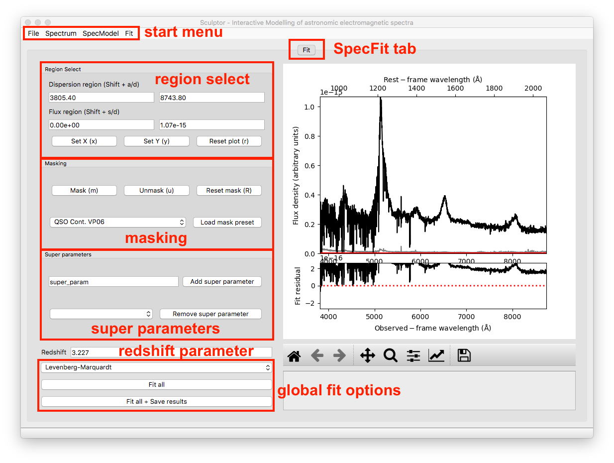
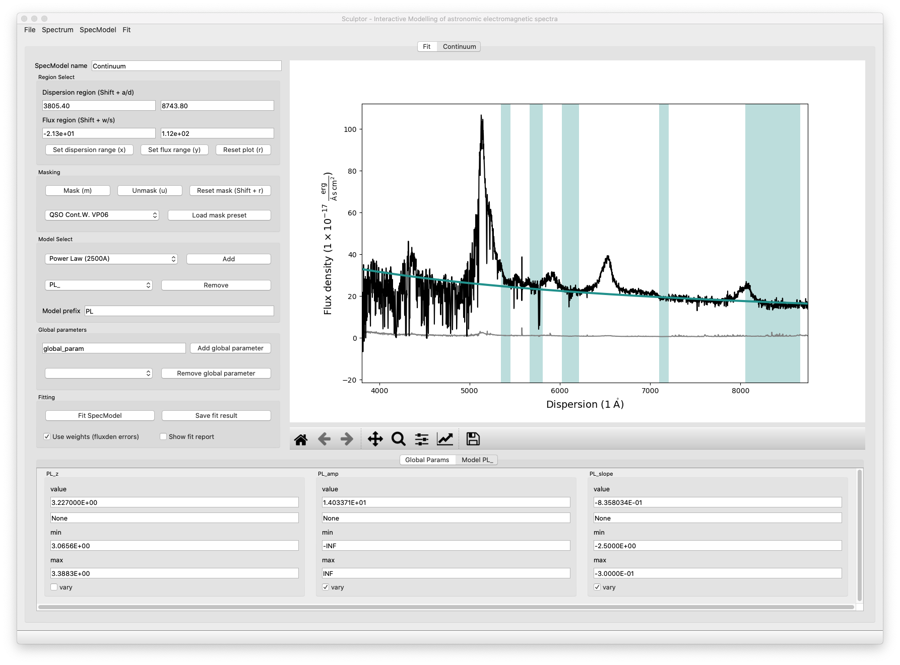
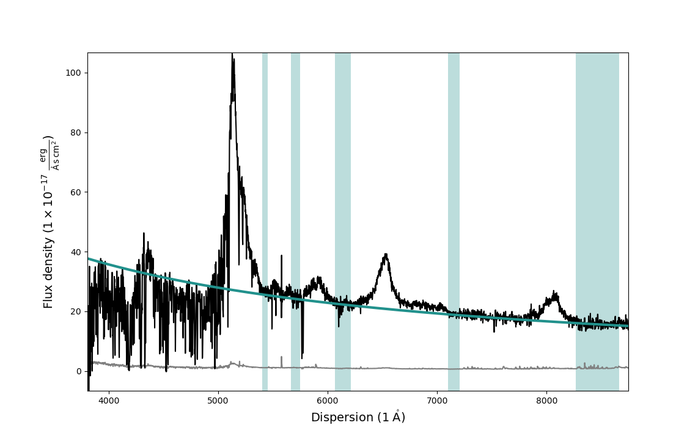
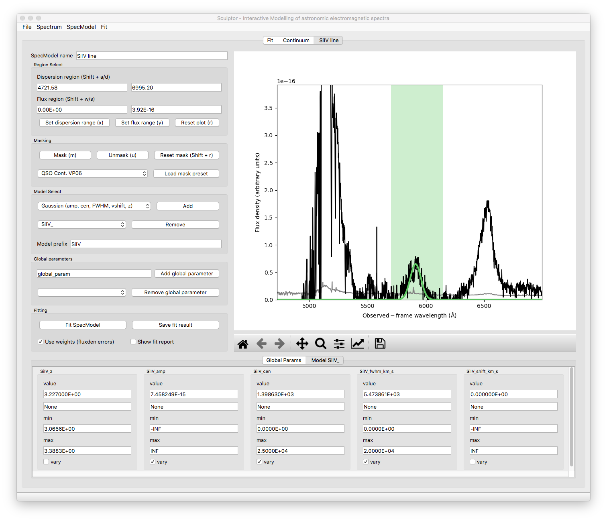
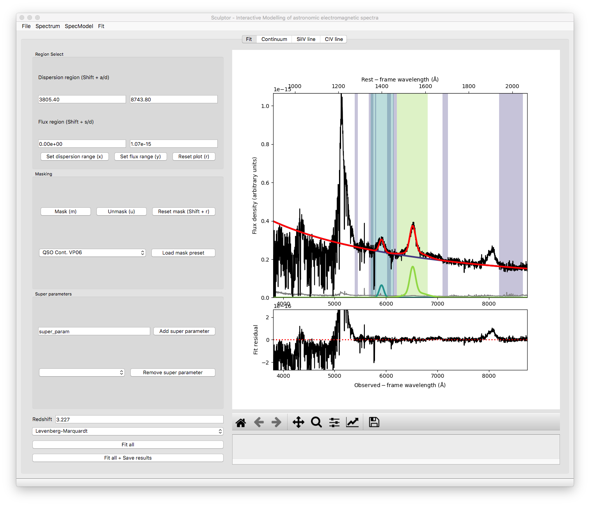
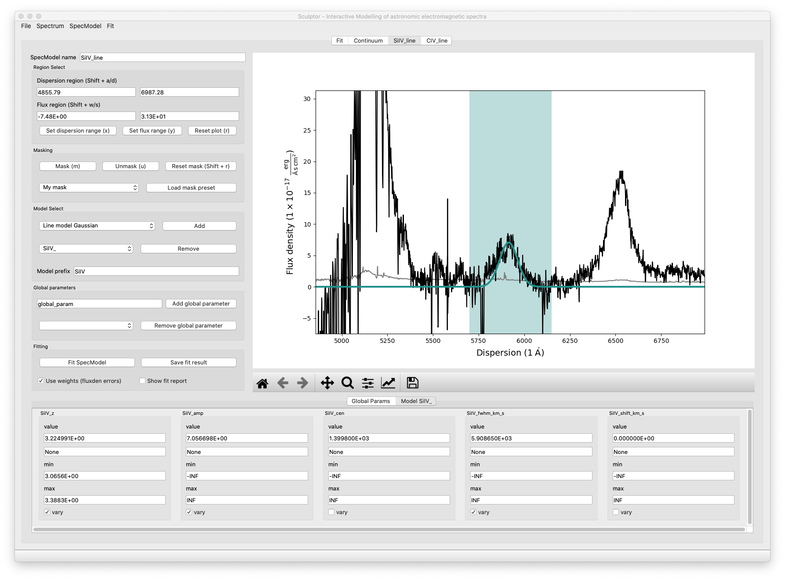

===========================================
Spectral fitting with Sculptor - An example
===========================================

In this example we will fit the SDSS spectrum of quasar J030341.04-002321.8 at redshift z=3.227 step by step. The example is aimed at first time user to provide insight into the Sculptor workflow and is designed to present a starting point.

We will begin by starting up sculptor with the example spectrum already imported:

.. code-block::

  run_sculptor --example=True

The GUI will start with the SpecFit tab open displaying the quasar spectrum.

1-The quasar continuum model
############################

In this example we will be working with the Sculptor basic models and the models defined in the Sculptor extension *my_extension.py*, which were specifically included for this example.

Steps
^^^^^
- Start by adding a *SpecModel* and naming it *Continuum*.
- Select the mask *QSO Cont. VP06*, which refers to quasar continuum regions according to the paper by Vestergaard & Peterson 2006.
- Add the *Power Law @2500A (amp, slope, z)* model with the prefix *pl*
- Click on *Fit SpecModel* for a first fit.

At this point the GUI showing *SpecModel* tab named *Continuum* should look like this:

Now we can interactively adjust the masked-in fit regions to exclude absorption and emission features and refit the spectrum again. Our final fit looks slightly better now:

2-Modeling the SiIV emission line
#################################

As the next step we will model the SiIV emission line at ~5900A observed frame with one Gaussian.

Steps
^^^^^
- Start by adding a another *SpecModel* and naming it *SiIV line*.
- Manually enter 5700 / 6150 into the dispersion region windows and apply with *Enter*.
- Click *m* to mask the specified dispersion region.
- Add the *Gaussian (amp, cen, FWHM, vshift, z)* model with the prefix *SiIV*.
- Enter 1399.8 into the *SiIV_cen* value field and apply the change with *Enter*.
- Click on *Fit SpecModel* to fit the line.

Note that the redshift (*SiIV_z*) and the velocity shift (*SiIV_vshift*) parameters have set default values used in the fit, but will not be fit themselves by default (*vary* checkmar not enabled). Feel free to change this if you want. However, if more than one of the three parameters (*SiIV_z*, *SiIV_cen*, *SiIV_vshift*) is set to *vary*, this will cause problems with the fit as they are degenerate.

The final SiIV fit will look something like this:

3-Modeling the CIV emission line
################################

We have now successfully modeled the SiIV line. Let us do the same for the CIV line, but this time we will approximate it using 2 Gaussian models.

Steps
^^^^^
- Start by adding a another *SpecModel* and naming it *CIV line*.
- Manually enter 6210 / 6810 into the dispersion region windows and apply with *Enter*.
- Click *m* to mask the specified dispersion region.
- Add the *Gaussian (amp, cen, FWHM, vshift, z)* model with the prefix *CIVb* (broad).
- Add the *Gaussian (amp, cen, FWHM, vshift, z)* model with the prefix *CIVn* (narrow).
- Enter 1549.06 into the *CIV_cen* value field for both models and apply the changes with *Enter*.
- Navigate into the *CIVb_* model tab and restrict the *CIVb_FWHM* values in the range of 2000 to 10000, then hit *Enter* to apply.
- Navigate into the *CIVn_* model tab and restrict the *CIVb_FWHM* values in the range of 300 to 3000, then hit *Enter* to apply.
- Click on *Fit SpecModel* to fit the line.
- **Check the fit results, specifically the FWHM values. You will find that the fit reached the maximum value you specified. This means that you should probably relax the upper FWHM boundary.Choose *CIVb_FWHM* max=30000, and *CIVn_FWHM max=8000* for now an click on *Fit SpecModel* again. The resulting fit should be a better approximation of the line.**

The final fit of the CIV SpecModel will look similar to this:

You can also navigate to the *SpecFit* tab (*"Fit"*) and look at the total fit to the quasar spectrum:

In the lower panel of the figure in the SpecFit tab you will also see the fit residual after all your models have been subtracted.

4-Saving and loading model fits
###############################

If you are happy with your first fit, you can save the model and the fit results.

Steps
^^^^^
- In the start menu click *File*->*Save*. This will open an file dialog.
- Create a new directory (e.g., you can name it *myfirstfit*)
- Save your model by clicking *Open* in the file dialog bottom right corner.
- Following this example Scuptor created four model files (*[SpecModel Index]_[prefix]\*_model.json *) for the *pl_*, the *SiIV_*, the *CIVb_*, and the *CIVn_* model as well as three result files (*[SpecModel Index]_fitresult.json*). The SpecModel Index in our example runs from 0-2 over the "Continuum", "SiIV line", "CIV line" SpecModels. The *fit.hdf5* file holds further information important for the SpecFit class and the SpecModel classes, including the spectrum itself.

You can now try to exit Sculptor and then open the Sculptor again:

.. code-block::

  run_sculptor

This should bring up an empty Sculptor GUI. To **load** your previously saved model click *File*->*Load* and select the folder, where you saved the model.

5-Fitting the SiIV line redshift
################################

Previously we have allowed the central wavelength of the SiIV line to be the varying parameter. To calculate the redshift of the SiIV line we can calculate the offset between the fitted central wavelength and 1399.8 A. However, with the Gaussian model we have used, we can directly fit the redshift parameter.

Steps
^^^^^
- Navigate to the *SiIV line* SpecModel tab and to the *Model SiIV_* parameters at the bottom.
- Set the value for *SiIV_cen* to 1399.8 and disable *vary* for the parameter.
- Then enable vary for the *SiIV_z* parameter.
- Click on *Fit SpecModel* to fit the line.

Now the redshift parameter was fit, while the central wavelength was considered constant:

6-A full fit of the example spectrum
####################################

We provide a full fit of the example spectrum in the *sculptor/examples* directory with the name *example_spectrum_fit*. We invite you to load this fit into Sculptor and explore the use of the *Global parameters* as well as the fitting of absorption lines.

.. image:: ../images/example_fit.png
  :width: 800
  :alt: Full fit of the example spectrum 
