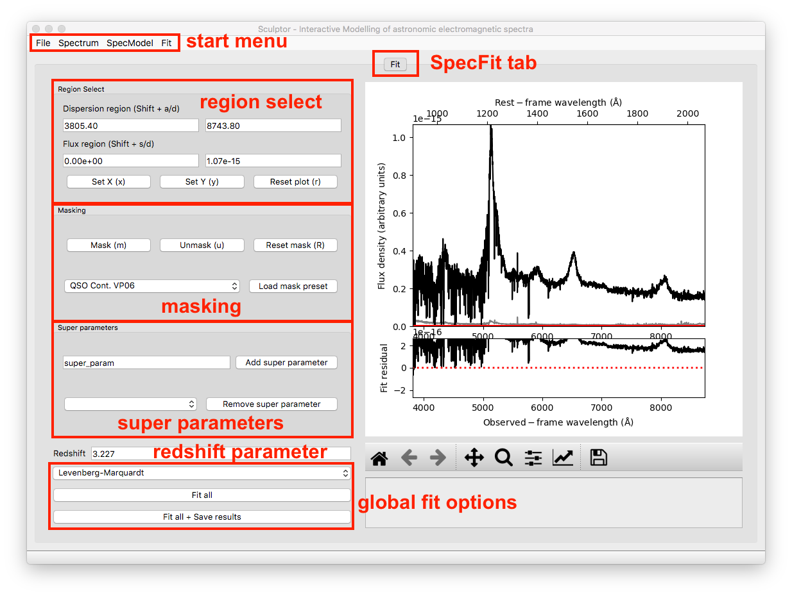
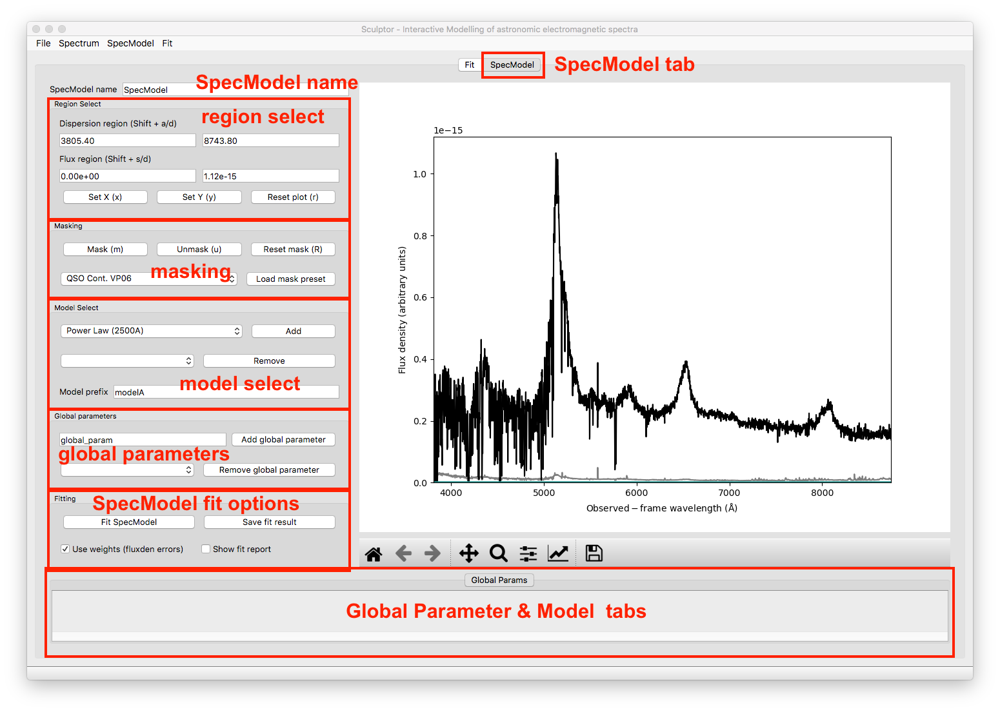

================
The Sculptor GUI
================

To carefully analyze small samples of astronomic spectra the Sculptor GUI offers an interactive way to put together complex spectral models. Therefore, we will start with an introduction to the GUI and its capabilities.

**Disclaimer:**
The following examples are intended to get familiar with the Sculptor GUI. The fit to the quasar spectrum in this example is exemplary and should not be considered *science grade*. Due to the rapid development of Sculptor, your current version of the GUI, might look different. 

A full model fit to an astronomical spectrum is internally set up as a *SpecFit* python object. This object holds general information on the spectrum (dispersion, flux density, redshift, etc.) and also defines the optimization method used when carrying out the fit (e.g., Levenberg-Marquardt). Spectral models, *SpecModel* python objects, are then added to the SpecFit object. Each SpecModel object can hold various fit models (e.g., multiple Gaussian emission line models), which are fit simultaneously to the spectrum. The SpecModel objects are *ordered* and the model fit of the first SpecModel is subtracted before the second SpecModel is fit and so on. This information is central to the way that Sculptor works and will help to understand the GUI.

Start by opening up the Sculptor example:

.. code-block::

  run_sculptor --example=True

This will open the main GUI and read in an SDSS spectrum of quasar J030341.04-002321.8 at redshift z=3.227. It should look something like this:

1-The Start Menu
################

On top of the window you will find the start menu with the *File*, *Spectrum*, *SpecModel*, and *Fit* drop down menus.

File
****
The *File* dropdown menu allows to *Load* and *Save* the full spectral fit (SpecFit object) and will open a File Dialog Window to select the folder to save to or to load from. It also allows to *Exit* the GUI. Keyboard shortcuts are indicated.

Spectrum
********
The *Spectrum* dropdown menu offers various ways to import a spectrum, overwriting the current spectrum and removing all masks.

SpecModel
*********
The fitting is done via the *SpecModel* object and without any *SpecModels* nothing can be fit. The *SpecModel* dropdown menu offers to *Add* a *SpecModel*, *Remove* the current (active tab) *SpecModel* or *Remove all SpecModels* altogether.

Fit
***
The *Fit* dropdown menu allows to specify further fit parameters when fitting the SpecModel with MCMC (*Set MCMC parameters*). It also offers the possibility to resample the spectrum on a pixel by pixel basis using its flux density uncertainties and fitting each resampled spectrum with the specified fit method (*Run resample and fit*). We will discuss this option at a later point in detail. One can specify a few settings for this option via the *Set resample and fit parameters* menu item.

2-The SpecFit Tab
#################
The SpecFit tab, called *Fit*, provides an overview over all fit SpecModels and the full spectral fit (sum of all individual SpecModels) in the figure to the right. We will now go through the different regions to the left of the figure.

Region Select
*************
The *Region Select* box allows to specify ranges in the dispersion of flux direction by direct input or interactively by pressing the *Shift* button together with *W*, *S*, *A*, or *D* while hovering with the cursor over the figure to the right. By doing so the values shown in the white fields are automatically updated. If the cursor is outside the figure no input will be passed.

The first two buttons below, which can also be accessed via keyboard shortcuts, allow to set the dispersion and flux density ranges of the figure to the right using the regions defined above. The last button *Reset plot* resets the plot ranges to show the full spectrum.

Masking
*******
The masking box provides capabilities for interactive masking of the spectrum. **In the SpecFit tab masking removes regions from the fit (greyed out visually).** The *Mask* button masks the dispersion range defined in the *Region Select*. The *Unmask* button unmasks the dispersion region defined in the *Region Select* and the *Reset Mask* button resets the mask unmasking the entire dispersion range.

Furthermore one can select a pre-defined mask in the drop-down menu and then mask out the pre-defined dispersion ranges via the *Load mask preset* button.

Super Parameters
****************
The *Super parameters* box allows to *Add* and *Remove* super parameters, which are defined on the highest level and then added to all SpecModels and individual models insight the SpecModel. Super parameters are defined here. If they are fitted by a SpecModel the values are adjusted globally and all future fits will now start with the updated values.

A use case for a super parameters could be the radial velocity of a star, for example. One can imagine that the first SpecModel fits the radial velocity via an absorption line shift relative to vacuum wavelength. All subsequent models use this velocity shift as an input value to analyze further spectral features.

Only special cases require the use of super parameters and because Sculptor fits SpecModels subsequently (one after another) care has to be taken, when using this advanced cabapility.

Redshift Parameter
******************
Extragalactic sources (e.g., galaxies, quasars, etc.) will be cosmologically redshifted. The SpecFit object has a redshift attribute, which can be set/updated here. The user can enter the value and set/update the internal value by hitting *Enter*.

The *redshift parameter* can be passed to spectral models as a keyword argument (kwarg), when they are added to a SpecModel object. This allows to build in set the redshift parameter when building a new model. Contrary to *super parameters* the global redshift value will **not** be updated when fit by any model.
However, the *redshift parameter* sets the rest-frame axis on top of the figure to the right.

Global Fit Options
******************
To the bottom left of the *SpecFit* tab is a drop-down menu and two buttons. The drop-down menu allows you to select the fit algorithm available in LMFIT. As a default the Levenberg-Marquardt algorithm is selected. For more on the differences of the minimzers see the LMFIT documentation (`The minimze function <https://lmfit.github.io/lmfit-py/fitting.html>`_).

One special option is the Maximum likelihood fit via Monte-Carlo Markov Chain, which uses `emcee <https://emcee.readthedocs.io/en/stable/>`_. Additional options for the MCMC runs are available under the *Fit* start menu item.

The *Fit all* button consecutively fits all SpecModels, whereas the *Fit all + Save results* button saves the fit results to a folder, which is selected by the user in a File Dialog. The results contain a png image of the figure shown in the SpecFit tab as well as a LMFIT fit report with the best fit values and covariances for each SpecModel saved in a ".txt" file.

3-The SpecModel Tab
###################

As a next step we click on *SpecModel* from the *Start Menu* and click on *Add SpecModel*. This will add a new SpecModel tab to the GUI and automatically switches to it. The figure now displays the spectrum without the residual plot below and would show only model fluxes and masks related to the active SpecModel.

SpecModel Name
**************
This input field allows you to change the name of the SpecModel from the default value "SpecModel". To apply the name change hit *Enter*. The name change is successful, when you see the name of the active tab change to your input.

Region Select
*************
The region select controls work exactly in the same way as for the SpecFit tab. However, all changes to the flux and dispersion range are, of course, only applied to the SpecModel figure to the right.

Masking
*******
The masking controls work in the same way as before with one important difference: mask regions now *mask in* ranges that should be considered in the SpecModel fit, whereas in the SpecFit tab masking excluded dispersion regions from all fits. The masked-in dispersion ranges are highlighted in color.

Custom user-defined masks can be added with new python modules as part of the **sculptor-extensions** package, included in the github repository. An example file *my_extension.py* adds the *QSO Cont. VP06* mask to Sculptor, which defines pure continuum regions for quasar modeling.

Model Select
************
The model select controls allow you to *Add* and *Remove* models selected by their name from the drop down menus. Before a model is added the model prefix (default: "modelA") can be specified for better readability of the results later on. For example, if someone wanted to the the Hydrogen Balmer line Hbeta, it would be appropriate to call the prefix "Hbeta". **Model prefixes cannot contain spaces.**

The models that can be added to the spectrum include a range of basic models (e.g., gaussian, power law, constant, etc.) included with Sculptor. Custom models can be defined by the user in new python modules as part of the **sculptor-extensions** package, included in the github repository. An example of such an extension module *my_extension.py* is provided there adding the *Power Law (2500A)* model.

Global Parameters
*****************

Similar to *Super parameters*, which are added to all models in *all* SpecModels, the *Global parameters* are added to all models in the *active* SpecModel. The controls allow to provide a custom name for a global parameter, *Add* the global parameter to the SpecModel or select an existing global parameter from the drop down menu and then *Remove* it.

Whereas the use cases for *Super parameters* are probably rare, use cases for *Global parameters* are much more common. For example, if we want to model a few emission lines, which we know should have the same width. We can easily define a new global parameter *FWHM_common* and set it to be the FWHM for all Gaussian emission line models in the SpecModel.

Fitting
*******
The fitting controls consist of two button and two toggle switches. The switch *Use weights (fluxden errors)* is by default enabled and uses the flux density uncertainty as weights in the fit. The second switch, *Show fit report* prints the LMFIT fit report in a pop-up window on the screen. This provides the user with metrics for the goodness of the fit, the best fit values and the fit covariances. If the MCMC method is chosen in the SpecFit tab, the fit report also plots the posterior distributions of all fit parameters. If the number of model parameters is large, the corner plot will be unfortunately hard to read.

The *Fit SpecModel* button fits the active SpecModel and the *Save fit result* button saves the fit results (fit report and figure png) for the active SpecModel.

Global Parameter & Model Tabs
*****************************
At the bottom of the SpecModel Tab is a field, which shows an empty tab called *Global Params*. All added global parameters will be shown in this tab. To further understand the function of this field let's add a power law model to the SpecModel.

.. image:: ../images/example_specmodel_1.png
  :width: 1000
  :alt: SpecModelTab_example

Adding the model added another tab to the field appropriately named after the chosen model prefix (PowerLaw). Navigating to the tab shows all the parameters for this specific model. In the case chosen here the model has two free parameters, the amplitude (PowerLaw_amp) and the slope (PowerLaw_slope).
For each parameter the user can now control the initial *Value*, the parameter range set by *min* and *max* and whether the parameter should be varied during the fit (*vary* toggle switch).

The field that currently shows the text *None* is the expression field. It allows to use mathematical constraints on the parameters. The LMFIT documentation for this topic is found `here <https://lmfit.github.io/lmfit-py/constraints.html>`_.

In the global parameter example above we described that we want to set the FWHM of multiple gaussian emission lines to our super parameter *FWHM_common*. This done via the expression field by entering the name of the global parameter and applying the change with *Enter*.

The expressions can only contain numbers, names of other parameters in the model and +, -, /, \*, (, ). If the expression is invalid the input will not be forwarded to the model and the text field will reset to previous expression after fitting the spectrum.
